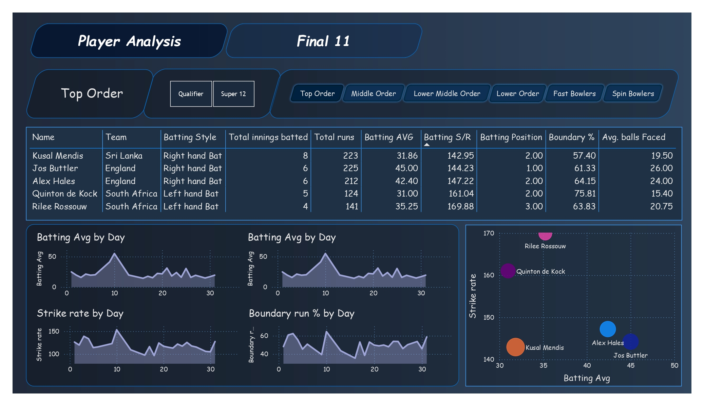

# T20_World_Cup_2022 Cricket Data Analytics🏏

---

Cricket Data Analytics🏏 is a comprehensive project leveraging T-20 Cricket World Cup data to deliver actionable insights through an interactive Power BI dashboard. The project enables users to analyze match performance, player statistics, and trends effortlessly. A standout feature is the ability to select the best playing XI from the pool of players who participated in the World Cup.

The dashboard provides an intuitive and interactive interface, empowering users to explore key metrics, compare player performances, and make informed decisions—all at their fingertips. To experience the dashboard, users can download the .pbix file from the repository and explore it in Power BI Desktop.

> To interact with the dashboard you can download the pbix file from the repository and open it in Power BI Desktop locally.

---

# Steps involved in the project:

Here’s an enhanced and structured rewrite of your project workflow steps:

---

### **Steps Involved in the Project**

1. **📝 Requirement Scoping**  
   - Defining the objectives and identifying key performance metrics to analyze T-20 Cricket World Cup data effectively.  
   - Outlining features like player performance analysis, match statistics, and the selection of the best playing XI.

2. **🌐 Data Collection**  
   - Utilizing web scraping techniques to extract detailed match and player data from the [ESPN Cricinfo](http://www.espn.in/cricket/) website.  
   - Tools used include Python libraries like **BeautifulSoup** or **Selenium** to scrape structured data efficiently.

3. **🧹 Data Cleaning and Preprocessing**  
   - Cleaning raw data using **Pandas** in Python to handle missing values, correct inconsistencies, and standardize formats.  
   - Preparing the dataset for smooth integration into Power BI for analysis.

4. **🪄 Data Transformation**  
   - Using **Power Query** in Power BI to transform data into a structured format.  
   - Tasks included creating calculated columns, merging datasets, and preparing data models for analysis.

5. **⚒️ Data Modeling and Parameter Building**  
   - Implementing **DAX** (Data Analysis Expressions) in Power BI to create calculated metrics such as strike rate, economy rate, and player rankings.  
   - Building parameters to allow interactive filtering and selection for customized analysis.

6. **📊 Dashboard Creation**  
   - Designing an interactive and visually appealing dashboard in **Power BI** to showcase insights.  
   - Features include:  
     - Player performance segmentation (e.g., power hitters, all-rounders, fast bowlers).  
     - Filters to explore specific teams, matches, or time periods.  
     - Tools for selecting the best playing XI based on performance metrics.

---

Let me know if you'd like to expand on any of these steps or add technical details!
---

# Screenshots of the Dashboard:

